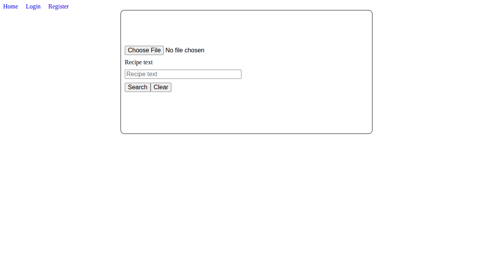
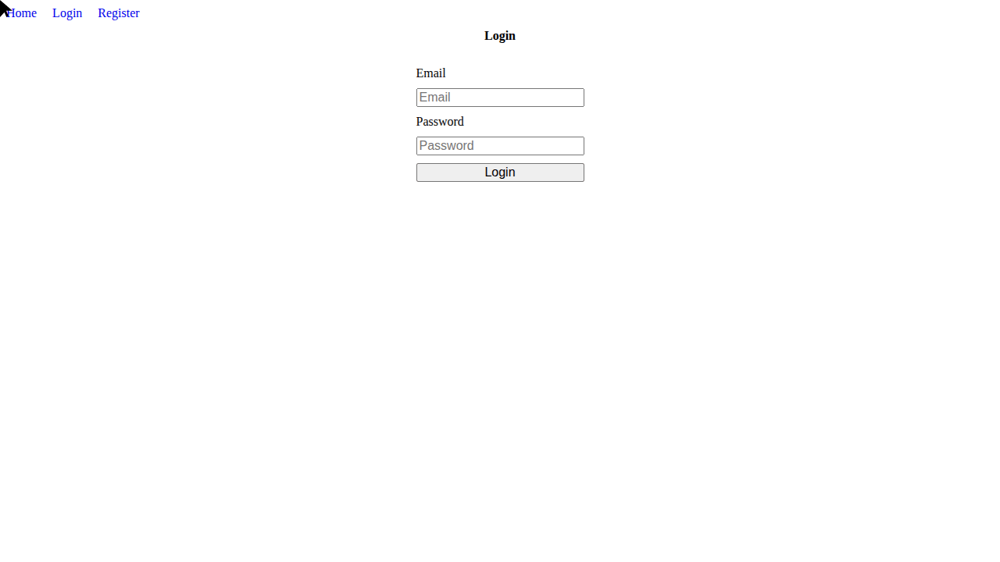

# Multimodal Recipe Search

A multimodal search engine for recipes, supporting text queries, image queries, or both combined.

## Overview

The system uses a two-stage retrieval pipeline. In the first stage, CLIP encodes the query and retrieves the closest matches from a Milvus vector index using late fusion of text and image similarity scores. In the second stage (optional), a vision-language model reranks the top results by visually comparing each candidate against the original query.

## Configuration

There are two config files:

- `config.env` — runtime settings read by the app via pydantic-settings
- `.env` — secrets used by Docker Compose (Postgres and MinIO credentials)

`config.env`:

- `ALPHA=0.8` — weight between image and text scores in late fusion (0.0 = image only, 1.0 = text only)
- `RETRIEVAL_SIZE=6` — number of results returned per search
- `PAGINATION_SIZE=10` — page size for the recipe list view
- `RERANKING=False` — set to `True` to enable Qwen reranking (off by default)
- `BUCKET_NAME=images` — MinIO bucket where recipe images are stored
- `COLLECTION_NAME=cooking_3000` — Milvus collection name

`.env`:

- `POSTGRES_USERNAME=<postgres-username>`
- `POSTGRES_PASSWORD=<postgres-password>`
- `MINIO_USER=<minio-user>`
- `MINIO_PASSWORD=<minio-password>`
- `DOCKER_VOLUME_DIRECTORY=/path/to/volumes`

Service hostnames (`MILVUS_HOST`, `MINIO_HOST`, `POSTGRES_HOST`) default to `localhost` and can be overridden for Docker deployments.

**Stack:**
- FastAPI + Uvicorn
- Milvus (vector search, recipe title/text/embeddings)
- MinIO (image storage)
- PostgreSQL (user accounts, Celery task results)
- CLIP ViT-B/16 (retrieval)
- Qwen3-VL-4B-Instruct 4-bit NF4 (reranking)
- Jinja2 templates (frontend)

## Async processing

Recipe uploads and edits are handled by a Celery worker instead of inline in the request handler. The **/api/v1/recipes** endpoints enqueue a **process_recipe** task and return immediately; the worker generates the CLIP embeddings, uploads the image to MinIO and writes to Milvus in the background. RabbitMQ is the broker and PostgreSQL stores task results and progress. Flower gives a UI for monitoring task status.

**start.sh** launches both the Celery worker and the Uvicorn server in the container.

## Docker

`docker-compose up` starts the full stack:

- **restApi** — the FastAPI app, built from `Dockerfile` using the `nvidia/cuda` base image, port 8081
- **standalone** — Milvus, port 19530
- **attu** — Milvus web UI, port 8001
- **minio** — object storage, port 9000 (API) and 9001 (console)
- **etcd** — Milvus's metadata store
- **db** — PostgreSQL, port 5432
- **rabbitmq** — Celery broker, port 5672 (AMQP) and 15672 (management UI)
- **flower** — Celery task monitoring UI, port 5555

The restApi container reserves an NVIDIA GPU, so a GPU and the NVIDIA Container Toolkit are required to run it.

## Data

Initial recipe data used to seed the app comes from the [RecipeQA NLP dataset](https://www.kaggle.com/datasets/jeromeblanchet/recipeqa-nlp-dataset/data) on Kaggle — images are stored in MinIO and recipe text is embedded and stored in Milvus.

## Demos

Playwright scripts that run the app in a browser and record the session as a gif. The app must be running at `http://localhost:8081` first.

- **demo/search_demo.py** — text search, image search and combined text+image search, scrolling through results each time. Saves **assets/text_image_combined_search.gif**.
- **demo/recipe_edit_demo.py** — admin login, edit a recipe's text, cross-checked against Milvus directly in Attu before and after the edit and against Flower to confirm the Celery task for the edit was created. Saves **assets/recipe_edit_demo.gif**.

### Text, image and combined search

Runs a text search, an image search, then a combined text+image search, scrolling through the results each time.

### Edit a recipe

Logs in as admin, edits a recipe's text and saves it. Milvus is queried directly in Attu before and after the edit to confirm the underlying record actually changed and Flower is checked before and after to confirm the edit's Celery task was created.

